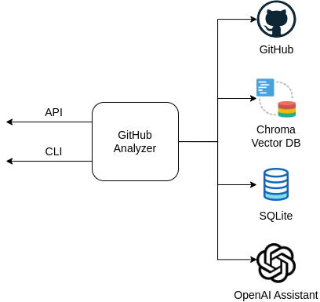
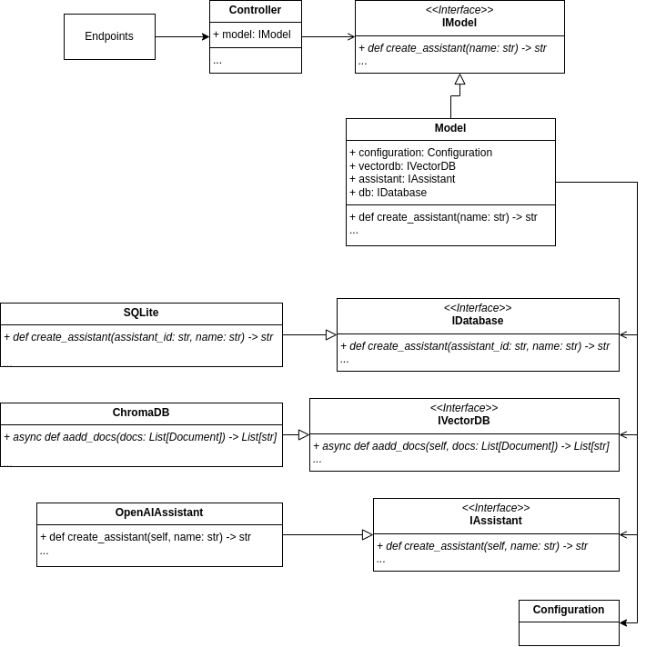
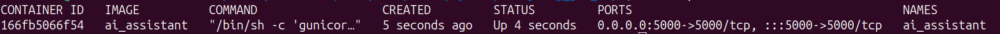

# GitHub analyzer
This repository hosts an AI Assistant to answer user questions about the provided GitHub repository. This application is useful for developers seeking to:
- Analyze code repositories
- Get AI assistance with code understanding
- Maintain contextual conversations about specific codebases
- Integrate AI-powered code analysis into their workflows

<!-- TOC -->
1. [Description](#1-description)
2. [Requirements and Setup](#2-setup)
3. [API](#3-api)
4. [Chunking strategy](#4-chunking-strategy)
5. [Improvements](#5-improvements)
<!-- TOC -->

## 1. Description
 

The main components of the application are shown in the figure and include: (1) the application itself (Python), (2) an API for performing basic operations, (3) a CLI interface as a wrapper of the API, (4) a local vector database (Chroma), (5) a local relational database - SQLite, and (6) an AI assistant hosted by OpenAI. 
The overall workflow of the application involves the following key steps:

1. **Creating an OpenAI Assistant**. A new OpenAI Assistant is created, using its API. 
2. **Retrieving files from a provided GitHub repository**. Retrieve files from a specified GitHub repository, smart files chunkuig based on the file types ([see section 4](#4-chunking-strategy)), and store the resulting fragments locally. These fragments are then embedded into a local vector database (ChromaDB).
3. **User Query Handling**: 
   - Request an initial response from the created assistant.
   - If the response involves searching the repository, perform similarity serach and provide the search results to the assistant.
   - Obtain an updated response from it.
   
The class structure is shown in the following diagram.



1. Controller class is responsible for handling input validation and coordinating the flow of data and operations. The controller acts as an intermediary between the API and the model.

This class provides methods for:
- Validating and processing GitHub repository URLs
- Creating and managing repository analysis threads
- Creating assistants for repository analysis
- Managing conversations between users and assistants
- Checking repository processing status

2. Model class that handles GitHub repository processing and AI assistant conversations. The class implements the IModel interface and coordinates between vector database, AI assistant, and database components to provide a complete repository analysis and conversation system.

This class provides functionality to:
- Process GitHub repositories by downloading and indexing files
- Create and manage AI assistants
- Manage conversation threads
- Handle asynchronous file processing
- Interface with vector and traditional databases

3.  SQLite class is a database handler implementation that manages interactions with a SQLite database file. It sets up and manipulates the database, providing methods to create, retrieve, and update records for assistants, threads, and repositories.

4. ChromaDB class implements the IVectorDB interface to provide vector database functionality using local vector database Chroma. This class handles document storage, retrieval and similarity search using embeddings from OpenAI. It provides both synchronous and asynchronous methods for adding documents and supports configurable similarity search parameters.

5. OpenAIAssistant class implementation that provides conversational AI capabilities. This class implements the IAssistant interface using OpenAI's API to create and manage AI assistants specialized in answering questions about GitHub repositories. It handles:
- Creating and configuring OpenAI assistants
- Managing conversation threads
- Processing messages between users and the assistant
- Integrating with vector database for repository data retrieval
- Formatting and returning conversation results

There are two ways to interact with the application: an API and a CLI utility, which is a wrapper around the API. API endpoints are described in the [section #3](#3-api), CLI utility supports the following set of commands:

1. ```python assistant_cli.py assistant create --name assist_name``` - creates an AI Assistant with the name assist_name (if this assistant already exists, doesn't create anything). It returns the assistant_id
2. ```python assistant_cli.py repo process --assistant_id assist_123 --url https://github.com/owner/repo_name.git``` - processes a provided Github repo and returns the thread_id
3. ```python assistant_cli.py repo check --thread_id thread_123``` - Checks a repo status. It can be either "processing" or "completed"
4. ```python assistant_cli.py conversation start --assistant_id assist_123 --thread_id thread_123``` - enters in the conversation loop     

## 2. Requirements and Installation

### 2.1. Requirements
- Python 3.10 or higher
- OpenAI API key

### 2.2. Installation

#### 2.2.1. WITHOUT Docker

- Clone the repository
- Set up a Python virtual environment, using the specific Python executable for Python 3.10:
```bash
python3.10 -m venv my_env_name
```
- Activate the virtual environment
```bash
source my_env_name/bin/activate
```
- Install the necessary packages
```bash
pip install -r requirements.txt
```
- Add your OpenAI API key as an environment variable
```bash
export OPENAI_API_KEY=your_open_ai_key
```
- Run the main.py file
```bash
python main.py
```

#### 2.2.2. WITH Docker
- Clone repository
- Create docker image
```bash
docker build -t ai_assistant .
```
- Create a container
```bash
docker run -d \
--name ai_assistant \
-v /path/to/host/data:/app/data \
-v /path/to/host/logs:/app/logs \
-e OPENAI_API_KEY=your_open_ai_key \
-p 5000:5000 \
ai_assistant
```

*/path/to/host/data* - folder on your computer to store local version of vector database (Chroma) and SQLite file.

*/path/to/host/logs* - folder on your computer to store logs.

- Check that the docker container has been created and started:
```bash
docker ps
```


- You can request http://127.0.0.1:5000

```bash
curl --location 'http://127.0.0.1:5000/api/v1/assistant/create' \
--data '{
"name": "GitHub_analyzer_12345"
}'
```

#### 2.2.3 Using the CLI utility, if the API was installed using Docker

- Set up a Python virtual environment, using the specific Python executable for Python 3.10:
```bash
python3.10 -m venv my_env_name
```
- Activate the virtual environment
```bash
source my_env_name/bin/activate
```
- Install the necessary packages
```bash
pip install -r assistant_cli_requirements.txt
```
- Add the address of the deployed API as an environment variable
```bash
export ASSISTANT_API_URL=http://127.0.0.1:5000
```
- Use commands specified in [section #1](#1-description)
```bash
python assistant_cli.py assistant create --name assist_name
```

## 3. API
A comprehensive description of the API can be found here- 
https://documenter.getpostman.com/view/10311884/2sAYX9kz9h

It is worth noting the usual order of calling endpoints:
1. **/api/v1/assistant/create** - to create an assistant. In response, we receive assistant_id
2. **/api/v1/repo/process** - to asynchronously download files from the main branch of the specified GitHub repository (use the received assistant_id). In response, we receive thread_id
3. **/api/v1/repo/check** - to check the status of file downloads (downloading the specified GitHub repository (use the received thread_id). In response, we receive the status: processing or completed
4. **/api/v1/conversation/message** - to send a user message (use the received assistant_id and thread_id). In response, the assistant's message processing status
5. **/api/v1/conversation/result** - to check the status of the assistant's response (use the thread_id). In response, if the status is completed, the assistant's response will be contained.

## 4. Chunking strategy
We use a language-specific chunking strategy. This means that the language is determined based on the file extension and then the appropriate separators are applied. For example, for Python they are ['\nclass ', '\ndef ', '\n\tdef ', '\n\n', '\n', ' ', '']. For Jupiter Notebook, the cells content is extracted first and then Python separators are employed. For other files, we utilize a token-based splitting. In addition, we add the file name to the beginning of each chunk. The chunk_size and chunk_overlap values can be specified in config.json

## 5. Improvements
**1. Security**
- API authorization
- Databases access

**2. Quality**
- Improve the chunking strategy (for example, generate a summary of each chunk and save its embedded vector, and the original in metadata). For this porpuse it's necessary choose a technique for evaluating the chunking strategy
- Refactoring

**3. Performance**
- Update files when re-specifying the repository address (for each file, calculate its hash and save it along with the file. When trying to re-download a file, check the hash values).

